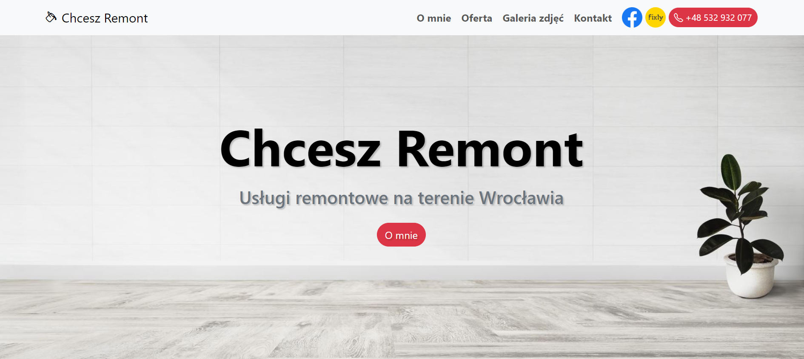

# Chcesz Remont

This commercial project represents a website promoting renovation services - www.chcesz-remont.pl

The project was created in Python, Django framework with the usage of Bootstrap 5. It was deployed at Mydevil.net platform. The domain was bought from LH.pl. The website is secured by SSL certificate.

## Features

- **Photo Gallery with filter functionality** (function-based view in "remonty" app: *gallery*),
- **FancyBox tool** for displaying images,
- Customized **Admin Page**,
- **Sitemap framework** installed  for SEO purposes,
- All templates created with **Bootstrap 5**.
